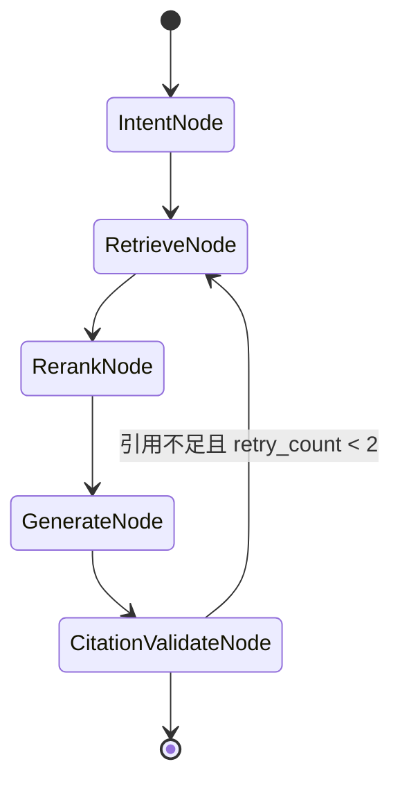

# 游戏策略 Agent 实施计划（Spring AI Alibaba）

## 目标范围（按你的优先级）

- **核心优先**：数据采集与知识库、可检索可溯源的对话建议、版本更新后 2 小时内可用。
- **游戏范围**：仅支持当前赛季与返场赛季，历史更早赛季暂不纳入首版。
- **交互优先级调整**：前端不做重 UI，但必须支持语音快交互与图像化输出。
- **前端从简**：保留核心能力——上传文档、输入网站链接、聊天、语音输入/播报、阵容图展示。
- **MVP 原则**：先做「稳定可跑 + 来源可解释」，再扩展视觉识别和复杂 Graph 分支。

## 一、总体架构（MVP）

```mermaid
flowchart LR
    userInput[UserInput]
    webUI[SimpleWebUI]
    ingestApi[IngestionController]
    scheduler[SpringScheduler]
    collectorOfficial[OfficialCollector]
    collectorSocial[SocialCollector]
    normalize[NormalizeAndTag]
    embed[DashScopeEmbedding]
    esIndex[ElasticsearchVectorStore]
    mongo[(MongoDBSessions)]
    reactAgent[ReactAgent]
    graph[StateGraphOptional]
    retriever[DocumentRetrieverPlusRerank]
    tools[SpringAIToolsAndMCP]

    userInput --> webUI
    webUI --> ingestApi
    scheduler --> collectorOfficial
    scheduler --> collectorSocial
    ingestApi --> collectorOfficial
    ingestApi --> collectorSocial
    collectorOfficial --> normalize
    collectorSocial --> normalize
    normalize --> embed
    embed --> esIndex
    webUI --> reactAgent
    reactAgent --> retriever
    retriever --> esIndex
    reactAgent --> tools
    reactAgent --> mongo
    reactAgent --> webUI
    graph -.-> reactAgent
```

**框架定位**：以 [Spring AI Alibaba](https://github.com/alibaba/spring-ai-alibaba)（SAA）为 Agent 运行时，以 Spring AI 的 `ChatModel` / `EmbeddingModel` / `VectorStore` / `DocumentRetriever` 为 RAG 底座，百炼 DashScope 为默认模型与向量化提供方。

## 二、技术选型（Spring AI Alibaba 栈）

| 层级 | 选型 | 说明 |
|------|------|------|
| 运行时 | JDK 21 + Spring Boot 3.4.x | 虚拟线程处理 I/O 密集采集与 ingest |
| AI 框架 | `spring-ai-alibaba-bom` + Agent Framework | ReactAgent、Graph、Streaming、Human-in-the-loop |
| 大模型 | DashScope（通义）为主 | `spring-ai-alibaba-starter-dashscope`；复杂推理可增配 OpenAI/DeepSeek ChatModel Bean |
| 向量化 | DashScope `text-embedding-v4` | 与 ES `dimensions` 配置一致 |
| 向量库 | Elasticsearch | `spring-ai-starter-vector-store-elasticsearch` |
| 精排 | DashScope Rerank | 检索后二次排序，提升 citation 准确度 |
| 会话 | MongoDB | 短期对话 + `distilled_summary` |
| Agent 记忆 | SAA Graph 持久化 / ChatMemory | 与 Mongo 蒸馏摘要互补 |
| 任务调度 | `@Scheduled` + `@Async` | 官方 12h 巡检、高优先级 ingest；量大时再引入 Redis Stream / RabbitMQ |
| 可观测 | Actuator + Micrometer + Langfuse/ARMS | SAA 内置 observations；生产可接阿里云 ARMS |
| 熔断降级 | Resilience4j | DashScope API 熔断、采集源过载保护、优雅降级 |
| AI 网关 | Higress（推荐生产） | 多模型统一接入与智能路由、Token 预算控制、TLS 与内容安全 |
| 安全认证 | Spring Security + OAuth2 | JWT/OIDC 资源服务保护 API，可选 SSO 集成 |
| API 文档 | SpringDoc OpenAPI 3 | REST 接口自动文档化，支持 Swagger UI |
| Schema 迁移 | Flyway + MongoTemplate 启动校验 | 索引版本管理、ES mapping 变更灰度 |
| 结构化日志 | Logstash Logback Encoder | JSON 格式日志输出，对接 ELK/Loki 聚合 |
| MCP / 工具 | Spring AI `ToolCallback` + SAA ToolNode | 后续扩展外部数据源、战绩查询等 |
| 前端 | 轻量 SPA（Vue/React）或 Thymeleaf | 调用 REST + SSE 流式回答 |
| 部署 | Docker Compose / K8s | `app` + `elasticsearch` + `mongodb` + 可选 `redis`；K8s 生产可选 |

**核心 Maven 依赖（示意）**：

```xml
<dependencyManagement>
  <dependencies>
    <dependency>
      <groupId>com.alibaba.cloud.ai</groupId>
      <artifactId>spring-ai-alibaba-bom</artifactId>
      <version>1.1.2.0</version>
      <type>pom</type>
      <scope>import</scope>
    </dependency>
    <dependency>
      <groupId>org.springframework.ai</groupId>
      <artifactId>spring-ai-bom</artifactId>
      <version>1.1.2</version>
      <type>pom</type>
      <scope>import</scope>
    </dependency>
  </dependencies>
</dependencyManagement>

<!-- Agent + DashScope -->
<dependency>
  <groupId>com.alibaba.cloud.ai</groupId>
  <artifactId>spring-ai-alibaba-starter-dashscope</artifactId>
</dependency>
<!-- ES 向量库 -->
<dependency>
  <groupId>org.springframework.ai</groupId>
  <artifactId>spring-ai-starter-vector-store-elasticsearch</artifactId>
</dependency>
</dependencies>
```

**企业级补充依赖（生产必备）**：

```xml
<!-- 测试 -->
<dependency>
  <groupId>org.springframework.boot</groupId>
  <artifactId>spring-boot-starter-test</artifactId>
  <scope>test</scope>
</dependency>
<dependency>
  <groupId>org.testcontainers</groupId>
  <artifactId>testcontainers</artifactId>
  <version>1.20.4</version>
  <scope>test</scope>
</dependency>
<dependency>
  <groupId>org.testcontainers</groupId>
  <artifactId>elasticsearch</artifactId>
  <version>1.20.4</version>
  <scope>test</scope>
</dependency>
<dependency>
  <groupId>org.testcontainers</groupId>
  <artifactId>mongodb</artifactId>
  <version>1.20.4</version>
  <scope>test</scope>
</dependency>

<!-- 安全 -->
<dependency>
  <groupId>org.springframework.boot</groupId>
  <artifactId>spring-boot-starter-security</artifactId>
</dependency>
<dependency>
  <groupId>org.springframework.boot</groupId>
  <artifactId>spring-boot-starter-oauth2-resource-server</artifactId>
</dependency>

<!-- 熔断与重试 -->
<dependency>
  <groupId>org.springframework.cloud</groupId>
  <artifactId>spring-cloud-starter-circuitbreaker-resilience4j</artifactId>
</dependency>

<!-- API 文档 -->
<dependency>
  <groupId>org.springdoc</groupId>
  <artifactId>springdoc-openapi-starter-webmvc-ui</artifactId>
  <version>2.8.5</version>
</dependency>

<!-- 数据库版本管理 -->
<dependency>
  <groupId>org.springframework.boot</groupId>
  <artifactId>spring-boot-starter-data-mongodb</artifactId>
</dependency>
<!-- MongoDB Schema 迁移：custom 或 mongock -->
<!-- 此处 MongoDB 索引变更建议在应用启动时通过 MongoTemplate 验证 -->

<!-- 结构化日志 -->
<dependency>
  <groupId>net.logstash.logback</groupId>
  <artifactId>logstash-logback-encoder</artifactId>
  <version>8.0</version>
</dependency>
```

**配置要点（`application.yml`）**：

```yaml
spring:
  ai:
    dashscope:
      api-key: ${DASHSCOPE_API_KEY}
      chat:
        options:
          model: qwen-plus          # 对话主模型，可按场景切换
      embedding:
        options:
          model: text-embedding-v4
    vectorstore:
      elasticsearch:
        initialize-schema: true
        index-name: game-strategy-index
        dimensions: 1024            # 与 embedding 维度一致
```

## 三、数据源策略（混合模式）

- **官方源（主干）**
  - 目标：版本公告、平衡改动、机制说明、赛季手册。
  - 方式：官网/公告页抓取 + RSS/API（若可用）+ Jsoup/HTML 清洗。
  - 更新：`@Scheduled` 每 12 小时巡检；检测到新版本 → 发布 `PatchDetectedEvent` → 高优先级 ingest（`@Async` + 独立线程池）。
- **社媒源（补充）**
  - 目标：抖音/B 站头部博主的阵容思路、转型时机、站位细节。
  - 方式：可用 API/结构化来源优先；不足再补采集器；沉淀「博主可信度评分」写入 Document metadata。
  - 控制：仅入库「可归因 + 可去重 + 可时间戳化」的内容。

**入库统一入口**：`IngestionService` 将 `Document`（含 metadata）交给 `VectorStore.add()`，由 Spring AI 自动调用 `EmbeddingModel` 向量化后写入 ES。

### 补充：金铲铲数据源调研计划

| 渠道 | 目标内容 | 调研方向 | 优先级 | 实现方式 |
|------|----------|----------|--------|----------|
| 金铲铲之战官网 | 版本公告、平衡改动、新赛季机制说明 | 确定 URL 结构、页面更新规律、RSS 可用性 | P0（主干） | 定时巡检 + RSS/HTML 抓取 |
| 腾讯官方 API | 赛季数据、棋子/羁绊数值、阵容胜率 | 确认内部/合作伙伴 API 是否开放，NDA 限制 | P0（主干） | HTTP 采集 + OAuth 鉴权 |
| 旅法师营地 | 阵容攻略、数据统计、版本解读 | 社区内容聚合，检查 API 或 RSS 支持 | P1（社媒） | Jsoup 解析 + 合规频率控制 |
| 掌上英雄联盟 / 掌盟 | 官方赛事、版本更新追踪 | 移动端页面结构适配 | P1（社媒） | 移动端 HTML 适配抓取 |
| B 站 | 头部博主（红莲/神超/弃徒等）版本解读、阵容思路 | 博主内容采集，去重与可信度评分 | P1（社媒） | B 站 API / RSS + 元数据标准化 |
| 抖音 | 短视频阵容教学、转型思路 | 热门视频采集，去重策略 | P2（社媒） | 公开 API / 合法采集 + 发布时间过滤 |
| NGA / 贴吧 | 玩家讨论、实时反馈 | 文本质量较低，适合做舆情辅助而非结构化知识 | P2（可选） | 关键词采集 + 低权重入库 |

**调研方法论**：
1. **第一周**：完成官网和腾讯渠道的技术可行性验证（URL 可达性、反爬策略、更新频率观测）
2. **第二周**：完成社媒渠道（旅法师营地、B站）的数据格式、体量和合规性评估
3. **输出物**：`docs/data-source-report.md`，包含每个源的接入成本估算、预期更新频率、数据质量标准
4. **决策点**：MVP 阶段可从"人工 curated 源 + 半自动采集"起步，不绑定单一采集策略

## 四、知识库与检索设计

- **索引分层（metadata 区分，可单索引多 filter）**
  - `source_type=official`：官方文本（检索 boost 更高）。
  - `source_type=social`：社媒策略摘要。
  - `source_type=skill`：`/skills/*.md` 规则文档（最高规则优先级）。
- **统一文档 metadata**
  - `source`, `source_type`, `author`, `published_at`, `version_tag`, `confidence_score`, `citation_url`
- **混合检索（MVP）**
  - **召回**：`VectorStore.similaritySearch(SearchRequest)` 或 `QuestionAnswerAdvisor` + 自定义 `FilterExpression`（按 `version_tag`、赛季过滤）。
  - **精排**：DashScope Rerank 对 topK 结果重排（社区实践中的「双重漏斗」）。
  - **回答**：`ChatClient` + `QuestionAnswerAdvisor` 或 ReactAgent 内置 RAG 工具；**强制**在 system prompt 中要求输出 `citations` JSON 字段。

### 补充：知识库冷启动策略

冷启动目标是让系统上线第一天就能回答当前赛季的核心问题。

| 阶段 | 动作 | 输出 |
|------|------|------|
| **T-7 天** | 整理当前赛季版本公告（官方新闻稿、更新日志）→ 人工清洗为 Markdown | 5-10 篇高质量官方文档 |
| **T-5 天** | 搜集头部博主的本赛季阵容攻略 → 摘要化处理 + 标注 `author`/`confidence` | 10-15 篇策论文档 |
| **T-3 天** | 编写 `/skills/` 规则文档（版本机制、棋子/羁绊说明、经济节奏口诀） | 3-5 篇 skill Markdown |
| **T-1 天** | 批量 ingest 以上文档 → 验证 ES 搜索结果质量 → Rerank 结果调优 | 可用的知识库 + 检索评估报告 |
| **T+0 天** | 上线后持续抓取最新公告，覆盖返场赛季的旧知识点 | 增量更新流水线 |

**ES 索引初始化脚本**：
- 使用 Spring Boot `CommandLineRunner` 或独立 `@PostConstruct` 方法，应用首次启动时检测索引是否存在
- 索引不存在则自动创建（`spring.ai.vectorstore.elasticsearch.initialize-schema=true`）
- 预置文档通过 `src/main/resources/data/seed/` 目录下的 JSON 文件批量导入
- `application.yml` 中 `spring.ai.vectorstore.elasticsearch.index-name` 按赛季命名 `game-strategy-s14` 风格，赛季切换时创建新 index alias

## 五、Agent 编排（Spring AI Alibaba）

### Phase 1：ReactAgent MVP（先可用）

使用 SAA **ReactAgent**（ReAct：Reasoning + Acting）：

1. **意图识别**：用户问题 + 可选赛季上下文 → 决定检索范围（官方 / 社媒 / skill）。
2. **工具调用**（`@Tool` / `FunctionCallback`）：
   - `searchOfficialMeta(versionTag, query)`
   - `searchSocialStrategy(query, minConfidence)`
   - `loadSkillDoc(skillName)` — 读取 `/skills` 规则
3. **多模型路由与降级**：
   - 默认模型：`qwen-plus`（平衡成本与质量）
   - 复杂推理（阵容克制计算等）：路由至 `qwen-max` 或 `gpt-4o-mini`
   - 简单问答/闲聊：`qwen-turbo`（最低成本）
   - 降级策略：优先 `DashScope → OpenAI → DeepSeek` 三级 fallback
   - 实现方式：多 `ChatModel` Bean + 自定义 `RouterService` 或 Higress 网关层路由
4. **Prompt Caching**：
   - 开头的 system prompt（技能规则、输出协议）利用 SAA 1.1.2+ 缓存能力
   - 降低重复请求的 token 消耗与首字延迟
5. **生成回答**：流式 `ChatClient.stream()` 返回 `text_advice` + `citations`。

**AgentState（Graph OverAllState 或自定义 DTO）**：

- `input`, `chat_history`, `distilled_summary`, `intermediate_steps`, `final_output`, `retry_count`
- 利用 SAA **工具重试**、**模型调用限制** 控制成本与稳定性。

#### 内置 MCP 工具接口规范

三个核心工具通过 `@Tool` 注解注册为 Spring AI ToolCallback，供 ReactAgent 调用：

```java
@Tool(name = "searchOfficialMeta", description = "搜索官方元数据（版本公告/平衡改动）")
public List<Document> searchOfficialMeta(
    @P("versionTag") String versionTag,  // 赛季版本号，如 "s14"
    @P("query") String query             // 用户问题关键词
)
// 返回：List<Document>，每个 Document 包含：
//   text: 文档摘要片段
//   metadata.source: 来源名称
//   metadata.source_type: "official"
//   metadata.published_at: 发布时间
//   metadata.citation_url: 原文链接
//   metadata.confidence_score: 1.0（官方源固定满分）

@Tool(name = "searchSocialStrategy", description = "搜索社媒策略内容（博主阵容/站位/节奏）")
public List<Document> searchSocialStrategy(
    @P("query") String query,               // 检索关键词
    @P("minConfidence") double minConfidence // 最低可信度阈值 0.0-1.0
)
// 返回：List<Document>，metadata 额外包含：
//   metadata.author: 博主名称
//   metadata.confidence_score: 可信度评分（0.0-1.0）
//   metadata.source_type: "social"

@Tool(name = "loadSkillDoc", description = "读取本地策略技能规则文档（最高优先级）")
public String loadSkillDoc(
    @P("skillName") String skillName // 文档名，如 "synergies", "economy", "positioning"
)
// 返回：Markdown 格式的完整规则文档内容
```

工具注册方式：通过 `@Component` + `@Tool` 注解自动扫描，或手动 `ToolCallback` Bean 注册。工具执行结果统一由 SAA 框架注入到 Agent 的 `intermediate_steps`。

### Phase 2：Graph 工作流增强

当单 Agent 不够用时，用 **StateGraph** 拆分节点：



- **并行**：`ParallelAgent` 同时拉官方 + 社媒检索，再合并。
- **路由**：`LlmRoutingAgent` 按意图走「版本解读 / 阵容推荐 / 经济节奏」分支。
- **Human-in-the-loop**：争议策略或低置信度时，挂起等待用户确认（可选，Phase 2+）。
- **可视化**：Graph 导出 Mermaid/PlantUML，便于与产品对齐流程。

## 六、记忆与会话持久化

- **短期**：`ChatMemory`（`MessageWindowChatMemory`）或 Mongo `sessions` 集合存 `chat_history`。
- **长期摘要**：`current_chat_history.size() > 10` → `@Async` 触发 `DistillService`，调用 DashScope 生成 `distilled_summary` 写回 Mongo。
- **Graph 持久化**：长会话或多轮工具调用时，启用 SAA Graph **快照 / checkpoint**，支持断点恢复（Phase 2）。
- **蒸馏模板**：玩家段位、偏好打法、本局路线、近期失败模式。

### 补充：多用户隔离与偏好

| 隔离维度 | 实现方式 | 数据域 |
|----------|----------|--------|
| 会话隔离 | Mongo `sessions` 集合中以 `user_id` 为 shard key | 每用户的对话历史和蒸馏摘要独立存储 |
| 记忆隔离 | `ChatMemory` 按 `user_id` 分桶，`MessageWindowChatMemory` 不同实例 | 用户 A 的上下文不影响用户 B |
| 反馈隔离 | Mongo `feedbacks` 集合中 `user_id` 字段 | 反馈数据可按用户追踪和统计 |
| 用户偏好 | Mongo `user_preferences` 集合存储：段位、偏好打法、阵容偏好、语音开关 | Agent 检索时附加偏好 filter |

**用户偏好模型**：
```json
{
  "user_id": "u_xxxx",
  "preferred_tier": "钻石",           // 段位
  "preferred_playstyle": "运营",       // 运营 / 赌狗 / 连败
  "preferred_synergies": ["法师", "神谕"],
  "voice_enabled": true,
  "voice_speed": 1.2,
  "created_at": "2026-05-25T00:00:00Z",
  "data_ttl": "P90D"                   // 数据保留 90 天
}
```

**数据清理 TTL**：Mongo TTL 索引自动清理超过保留期限的会话和偏好数据，避免存储膨胀。

## 七、2 小时更新 SLA 的落地机制

- **事件驱动**：`PatchDetectedEvent` → `HighPriorityIngestPipeline`（独立 `@Async` 线程池，避免阻塞定时任务）。
- **并行流水线**：抓取 ∥ 清洗 → 切片 → `vectorStore.add(batch)` → 索引 refresh；使用 `CompletableFuture` 或 Graph `ParallelNode`。
- **熔断与过载保护**：
  - Resilience4j CircuitBreaker 保护 DashScope API、外部采集源等不稳定依赖
  - `application.yml` 配置熔断阈值：`failure-rate-threshold=50`、`slow-call-rate-threshold=50`、`wait-duration-in-open-state=30s`
  - ingest 队列积压达到上限时触发背压（`RejectedExecutionException` 降级为日志告警，不丢失任务）
  - 采集源 HTTP 调用配置超时（connect=5s, read=30s）+ 重试（max-attempts=3, exponential-backoff）
- **可观测**：`IngestTask` 实体记录 `PENDING/RUNNING/SUCCESS/FAILED`；Actuator 暴露 ingest 队列深度与最近成功时间。
- **降级**：Embedding 延迟时，先写入纯文本 + BM25（ES 原生字段）保证「先可查」；向量化完成后补全向量字段。

## 八、最小前端能力（不做重 UI）

- 聊天页：SSE 流式显示答案与引用来源。
- 文档上传：`MultipartFile` → `IngestionController` → 异步处理状态轮询。
- 链接导入：提交 URL → 后端抓取 → 同上。
- 语音交互：STT/TTS 可调百炼语音 API 或第三方；快捷键 Push-to-Talk。
- 图像输出：调用 `lineup-card` 渲染 API（见下节）。

## 九、图像输出协议（阵容游戏核心）

- **默认输出**：结构化渲染引擎，根据 `board/bench/item_pool/synergies` 生成统一布局图（前端 Canvas/SVG 或后端 Java 绘图）。
- **可选输出**：用户要求「思路讲解图」时，调用 DashScope 图像模型（`ImageModel`）生成战术示意图。
- **返回 DTO**：
  - `text_advice`：文字建议。
  - `lineup_card`：阵容图 URL 或 base64。
  - `voice_text`：TTS 精简版（20–40 秒）。
  - `citations`：来源数组。
- **一致性约束**：图上信息必须来自 Agent 输出的结构化 JSON，禁止从自然语言自由「画」阵容。

## 十、语音交互协议（游戏内快节奏）

- 输入：按住录音 → STT → `ChatController` → ReactAgent。
- 输出：Agent 返回 `voice_text` → TTS 播报（可打断）。
- 策略：默认短回答；战斗回合优先「10 秒可执行动作」；支持「继续说细节」语音指令。

## 十一、API 与目录建议（Maven 多模块）

```
game-strategy-agent/
├── pom.xml                          # parent BOM：SAA + Spring AI
├── game-agent-common/               # DTO、metadata 常量、异常
├── game-agent-ingestion/            # 采集、清洗、Document 构建
├── game-agent-knowledge/            # VectorStore、Retriever、Rerank
├── game-agent-core/                 # ReactAgent、Graph、Tools、ChatMemory
├── game-agent-memory/               # Mongo 会话、蒸馏 worker
├── game-agent-api/                  # REST、SSE、上传、健康检查
├── game-agent-render/               # 阵容图结构化渲染
└── game-agent-bootstrap/            # Spring Boot 启动、配置、调度

frontend/                            # 简化聊天与上传
skills/                              # 策略技能 Markdown（最高优先级知识）
```

### 补充：统一错误码规范

#### 错误码分段规则

| 范围 | 所属模块 | HTTP 状态码 | 说明 |
|------|----------|-------------|------|
| `A0001` - `A0999` | Agent 运行时 | 500 | Agent 内部错误（意图识别失败、工具调用异常、LLM 响应超时） |
| `A1000` - `A1999` | Agent 工具 | 400 / 500 | 工具调用错误（检索失败、参数校验失败、工具超时） |
| `K0001` - `K0999` | 知识库 | 500 | 向量库错误（ES 连接失败、索引不存在、维度不匹配） |
| `K1000` - `K1999` | 知识库检索 | 404 / 500 | 检索错误（无结果、Rerank 失败、过滤条件冲突） |
| `I0001` - `I0999` | 采集 ingest | 400 / 500 | 采集错误（URL 不可达、解析失败、格式不支持） |
| `I1000` - `I1999` | 采集流水线 | 500 | 流水线错误（队列积压、Embedding 失败、ES 写入失败） |
| `G0001` - `G0999` | 网关与鉴权 | 401 / 403 | 认证授权错误（Token 过期、权限不足、限流触发） |
| `G1000` - `G1999` | 通用 | 400 / 429 | 参数校验失败、请求频率超限、资源不存在 |

#### SSE 错误事件格式

标准 SSE 协议中，错误通过 `event: error` 事件推送：

```
event: error
data: {"code": "A1000", "message": "知识库检索失败", "detail": "ES 连接超时", "trace_id": "xxx"}
```

#### 通用响应包装（REST）

```json
{
  "code": 0,
  "message": "success",
  "data": {},
  "trace_id": "a1b2c3d4-e5f6-7890-abcd-ef1234567890"
}
```
- `code === 0` 表示成功，非零为错误码
- `trace_id` 用于追踪请求链路的全局唯一标识

## 十二、分阶段里程碑（建议 4–5 周）

| 周次 | 交付 |
|------|------|
| 第 1 周 | Spring Boot + SAA DashScope 联调；官方 ingest + ES VectorStore；基础 `ChatClient` + RAG Advisor |
| 第 2 周 | 社媒源 + metadata 可信度；Rerank 精排；`citations` 协议固化；引入 Spring Security JWT 保护 API |
| 第 3 周 | ReactAgent MVP + `@Tool` 检索工具；多模型路由与降级接入；SpringDoc API 文档；阵容图渲染 API |
| 第 4 周 | 语音链路 + 前端 SSE 对接；Mongo 会话 + 蒸馏 `@Async` worker |
| 第 5 周 | SLA 事件流水线 + Resilience4j 熔断；Actuator 监控 + 告警规则；CI/CD 流水线（GitHub Actions + Docker） |
| 第 6 周 | 集成测试（Testcontainers）+ Agent 评估测试；内容安全过滤与 Prompt Injection 防御；前后端联调 + UAT |
| 第 7 周 | 多环境配置（staging/prod）；成本监控仪表盘；压测与性能优化；生产发布

### 补充：金铲铲评估数据集与自动化评测

#### 评估数据集构建（MVP 阶段 50+ 问答对）

| 类别 | 数量 | 示例问题 | 预期回答特征 |
|------|------|----------|-------------|
| 版本解读 | 10 | "S14 赛季新增了哪些羁绊？" | 引用官方公告，列出新增羁绊名称和效果 |
| 阵容推荐 | 15 | "当前版本 T0 阵容是什么？" | 引用社媒 + 官方数据，给出具体阵容构成 |
| 装备合成 | 8 | "羊刀怎么合成？给谁带？" | 引用 skill 规则文档，给出合成路径和推荐棋子 |
| 经济节奏 | 8 | "连胜怎么运营经济？" | 引用 skill + 头部博主策略，分阶段说明 |
| 站位克制 | 7 | "打刺客怎么站位？" | 引用社媒策略+skill，给出站位图和逻辑 |
| 边缘/对抗 | 5 | "同行两家怎么办？" | 综合多来源策略，展示变阵思路 |

#### 自动化评测指标

| 指标 | 目标值 | 评测方式 |
|------|--------|----------|
| 回答准确性 | ≥ 85% | 人工标注 + LLM-as-Judge 验证 |
| 引用正确率 | ≥ 90% | 检查 citations 中的 URL 是否可回溯到原始来源 |
| 幻觉率 | ≤ 5% | 回答事实与知识库内容一致性检测 |
| 覆盖度 | ≥ 80% | 评估数据集中的所有问题是否能给出有实质内容的回答 |

#### CI 门禁集成

- 每个 PR 合并前自动运行评估套件（`mvn verify -Peval`）
- 评估结果生成 JSON 报告存档，支持趋势分析
- 指标回退超过阈值则阻断合并，防止 Agent 质量退化

## 十三、与旧方案（Python/FastAPI）的主要差异

| 维度 | 旧方案 | 新方案（SAA） |
|------|--------|----------------|
| 语言/runtime | Python FastAPI | Java 21 Spring Boot |
| Agent | 手写 ReAct 循环 | ReactAgent + 可选 StateGraph |
| 队列 | Celery/RQ + Redis | `@Scheduled` + `@Async`（按需加 MQ） |
| 模型路由 | 自研 Qwen + DeepSeek 路由 | DashScope 为主，多 `ChatModel` Bean 路由 |
| RAG | 自研 BM25+向量 | VectorStore + Rerank + Advisor |
| 流式 | 自研 SSE | `ChatClient.stream()` / Graph Streaming |
| 工具/MCP | 后期接入 | SAA 原生 Tool + MCP（Nacos 注册可选） |

## 十四、风险与约束

- **百炼配额与延迟**： ingest 批量化时注意 Embedding QPS；必要时分批 + 退避重试。
- **ES 维度一致性**：更换 embedding 模型需重建索引或新 index alias 切换。
- **社媒合规**：采集范围、频率需符合平台 ToS；MVP 优先人工 curated 源。
- **版本**：跟进 [spring-ai-alibaba](https://github.com/alibaba/spring-ai-alibaba) 与 [java2ai 文档](https://java2ai.com/docs/) 的 GA 版本号，BOM 统一锁定。
- **LLM 成本失控**：无 token 预算控制可能导致 API 费用超支；需落地成本埋点与配额拦截机制（见第十六章）。
- **Prompt Injection 攻击**：用户输入可能诱导 Agent 越权执行工具；需在 system prompt 层和输入层双过滤。
- **数据隐私**：用户对话数据需明确保留周期，避免合规风险；MVP 不采集个人身份信息。

## 十五、参考资源

- 官方仓库：https://github.com/alibaba/spring-ai-alibaba
- 中文文档：https://java2ai.com/docs/
- 示例工程：https://github.com/spring-ai-alibaba/examples
- Spring AI ES VectorStore：https://docs.spring.io/spring-ai/reference/api/vectordbs/elasticsearch.html
- Higress AI 网关：https://higress.io/
- Spring Resilience4j：https://spring.io/projects/spring-cloud-circuitbreaker

---

## 十六、企业级生产就绪清单

以下清单覆盖从「能跑」到「能上线」的关键差距，按优先级分为 **P0（阻断级）**、**P1（重要）**、**P2（增强）**。

### P0 — 无此能力不可上线

#### 1. 测试策略

| 类型 | 覆盖范围 | 工具 | MVP 目标 |
|------|----------|------|----------|
| 单元测试 | Tool 逻辑、IngestionService、DistillService | JUnit 5 + Mockito | 核心模块覆盖率 ≥ 80% |
| 集成测试 | VectorStore CRUD、Mongo 会话、DashScope API 联通 | Testcontainers (ES + Mongo) | 每个数据层操作有集成测试 |
| Agent 评估测试 | 回答准确率、引用正确率、幻觉率 | SpringAiTest + 自定义 eval 数据集 | 发布前通过评估门禁 |
| 安全性测试 | JWT 鉴权、Prompt Injection 防护、XSS/CSRF | OWASP ZAP / 手动渗透 | 高风险项清零 |

#### 2. 安全防护

- **认证授权**：Spring Security + OAuth2 Resource Server，API 统一 Bearer Token 鉴权
- **Prompt Injection 防御**：
  - System prompt 末尾加隔离指令，分隔用户输入与系统指令
  - 敏感工具（如 ingest 写入操作）前置确认对话框或二次鉴权
  - 输入长度限制与异常字符过滤
- **内容安全**：输出层过滤，关键词 + DashScope 内容审核 API 阻断违规内容
- **API 限流**：Spring Cloud Gateway / Bucket4j 按用户/IP 限流，防止滥用刷 API

#### 3. CI/CD 流水线

```yaml
# .github/workflows/ci.yml 示意
name: CI
on: [push, pull_request]
jobs:
  build:
    runs-on: ubuntu-latest
    steps:
      - uses: actions/checkout@v4
      - name: Set up JDK 21
        uses: actions/setup-java@v4
        with: { java-version: '21', distribution: 'temurin' }
      - name: Maven Verify (incl. tests)
        run: mvn -B verify
      - name: SonarQube Quality Gate
        run: mvn sonar:sonar
      - name: Build Docker Image
        run: docker build -t game-agent .
      - name: Trivy Vulnerability Scan
        run: trivy image game-agent
```

- **CI 门禁**：代码检查（Checkstyle）+ 单元测试 → 集成测试 → 安全扫描 → Docker 构建
- **CD**：main 分支合并后自动部署 staging 环境；tag 触发生产发布

### P1 — 应在上线前准备

#### 4. LLM 成本控制

| 策略 | 实现方式 | 预期节省 |
|------|----------|----------|
| Token 预算 | 每次请求设 `maxTokens`，用户级日配额 | 防止单个用户耗尽预算 |
| Prompt Caching | 复用 system prompt 的 cached token | 40-60% 首轮推理成本 |
| 嵌入缓存 | 相同文本的 embedding 结果缓存（Caffeine） | 减少重复调用 |
| 模型分层 | qwen-turbo（简单问答）→ qwen-plus（默认）→ qwen-max（复杂推理） | 平均成本降低 50%+ |
| 成本埋点 | 每次 ChatModel/Embedding 调用记录 token 用量到 metrics + DB | 预算告警与用量分析 |

**成本估算模型**（基于 500 DAU，活跃 2h）：

| 模型 | 场景 | 日均请求 | 输入 token | 输出 token | 日成本估算 |
|------|------|----------|-----------|-----------|-----------|
| qwen-turbo | 闲聊/简单问答（缓存命中） | 2,000 | 200 | 100 | ~¥0.80 |
| qwen-plus | 默认策略问答 | 1,000 | 800 | 300 | ~¥2.50 |
| qwen-max | 复杂推理（阵容克制） | 200 | 1,500 | 500 | ~¥3.00 |
| text-embedding-v4 | 文档向量化 | 100 篇×3 次 | 512 token | - | ~¥0.15 |
| DashScope Rerank | 精排 | 500 | 200 token/次 | - | ~¥0.50 |

**成本控制机制**：
- **嵌入缓存**：Caffeine 本地缓存相同文本的 embedding，TTL=24h，预期命中率 60-70%
- **Prompt Caching**：system prompt 部分启用 SAA 1.1.2+ 缓存，节省 40-60% 首轮推理成本
- **用户日配额**：单用户每日 max 100 次 qwen-turbo / 50 次 qwen-plus / 10 次 qwen-max 调用
- **预算告警**：日成本超过 ¥20 触发钉钉/企微告警，超过 ¥50 自动降级至仅 qwen-turbo

#### 5. 多模型路由与降级

```
客户端 → Higress/自定义 RouterService
         ├── 主路由 → DashScope qwen-plus（正常）
         ├── 复杂路由 → DashScope qwen-max（意图判别后）
         ├── 降级 1 → OpenAI gpt-4o-mini（DashScope 不可用）
         └── 降级 2 → DeepSeek（OpenAI 也不可用）
```

- 每个 `ChatModel` Bean 相互独立
- 降级触发条件：连续 3 次超时 / 5xx / 空响应
- 恢复探测：每 30s 发送一次健康请求，成功后切回主路由

#### 6. 多环境配置

| 环境 | 配置文件 | 关键差异 |
|------|----------|----------|
| dev | `application-dev.yml` | DashScope mock（本地开发无 API 依赖）、H2/嵌入式 ES |
| staging | `application-staging.yml` | 真实 DashScope 但使用 qwen-turbo、共享 ES/Mongo 实例 |
| prod | `application-prod.yml` | 全模型能力、独立 ES/Mongo 集群、Higress 网关前置 |

#### 7. Schema 变更管理

- MongoDB：应用启动时 `MongoTemplate.indexOps()` 校验/创建索引（代码即 Schema）
- ES：索引 mapping 变更走 `create Index alias` 平滑切换，不原地修改
- 变更记录保存在 `src/main/resources/migrations/` 按时间戳命名

#### 8. 反馈闭环

- 每条回答附带 `message_id`，前端展示赞/踩/纠错按钮
- 后端 `FeedbackController` 接收反馈存入 Mongo `feedbacks` 集合
- 每周将低分问答（≤ 2 星）导出为评估数据集
- 评估数据集驱动 Agent prompt 与 RAG 策略迭代（数据飞轮）

### P2 — 上线后迭代完善

#### 9. 告警规则（Prometheus AlertManager / ARMS）

| 告警项 | 阈值 | 严重度 |
|--------|------|--------|
| LLM API 错误率 > 5% | 1m 窗口 | P0 |
| P99 对话延迟 > 10s | 5m 窗口 | P1 |
| Embedding 队列积压 > 1000 | 瞬时 | P1 |
| Ingest 失败率 > 10% | 1h 窗口 | P2 |

#### 10. 知识生命周期管理

- 赛季过期后自动降低 `confidence_score` 而非删除
- 文档元数据带 `version_tag`，检索时按 `version_tag >= current_season` 过滤
- 定期清理孤立的 vector 文档（已删除源内容对应索引条目）

#### 11. 结构化日志与链路追踪

- 日志格式：JSON（logstash-logback-encoder），包含 `traceId`、`spanId`、`userId`、`messageId`
- 全链路追踪：Micrometer Tracing → OpenTelemetry → Jaeger/阿里云 ARMS
- 关键日志埋点：用户请求入站、Agent 意图识别结果、Tool 调用入参/出参、LLM 响应耗时

#### 12. 服务依赖健康检查

| 依赖 | 检查方式 | 超时 | 降级行为 |
|------|----------|------|----------|
| DashScope API | `/v1/models` 探活 + ChatModel 空调用 | 5s | 标记不可用 → 触发多模型 fallback |
| Elasticsearch | `ClusterHealthResponse` + ping | 3s | 只读模式（检索走 BM25 + 本地缓存） |
| MongoDB | `MongoTemplate.executeCommand("{ping:1}")` | 3s | 停用会话功能（降级为无状态模式） |
| 采集源 | HTTP HEAD 检查站点可达性 | 5s | 跳过该采集源，告警通知 |

**启动预热检查**（`ApplicationRunner`）：
1. 检查 ES 索引是否存在 → 不存在则自动创建
2. 检查 Mongo 集合和索引 → 不存在则初始化
3. 发送一次 DashScope 空调用验证 API 连通性
4. 启动失败时：打印明确的错误信息，应用以「降级模式」启动（标记不可用依赖）

**K8s 探针配置**：
```yaml
livenessProbe:  GET /actuator/health/liveness
readinessProbe: GET /actuator/health/readiness
startupProbe:   GET /actuator/health/readiness  initialDelaySeconds: 30
```

#### 13. 压测与性能基准

| 场景 | 目标 QPS | P99 延迟 | 工具 |
|------|----------|----------|------|
| 简单问答（缓存命中） | 50 | < 2s | k6 |
| 复杂检索问答 | 20 | < 8s | k6 |
| Ingest 小批量（10 文档） | 5/s | < 5s | JMeter |
| SSE 流式并发 | 30 连接 | < 10s | k6 |

### P1 补充 — 新增生产章节

#### 14. 数据备份与恢复

| 组件 | 备份策略 | 恢复目标 |
|------|----------|----------|
| Elasticsearch | 每日增量快照（1h 窗口）+ 每周全量快照 | RTO ≤ 4h / RPO ≤ 1h |
| MongoDB | 副本集 3 节点 + 每日 oplog 归档 | RTO ≤ 2h / RPO ≤ 5min |
| 配置文件 | Git 版本管理 + 加密 secrets 独立存储 | 回滚至任意历史版本 |
| 用户数据 | Mongo 导出 + 加密冷备（90 天保留） | 合规审计可追溯 |

**ES 快照实施**：
- 注册快照仓库：`PUT _snapshot/game-agent-backup { "type": "s3", "settings": { "bucket": "...", "region": "..." } }`
- 每日快照策略：`CURATOR` 或 ILM 策略保留最近 30 天快照
- 恢复演练：每季度执行一次从快照恢复至 staging 环境，验证数据完整性

#### 15. 容量规划模型

**存储估算**：

| 类型 | 单位文档大小 | 日均增量 | 3 个月预估 |
|------|-------------|----------|------------|
| ES 向量文档 | 2KB（含 1024 维向量 + metadata） | 100 篇 | ~18 GB |
| ES 纯文本字段 | 0.5KB | 100 篇 | ~4.5 GB |
| Mongo 会话 | 5KB/会话（含 chat_history） | 500 会话 | ~225 MB |
| Mongo 反馈 | 0.5KB/条 | 100 条 | ~4.5 MB |

**QPS 预估**：假设 MVP 初期 500 DAU，活跃时段集中在 2h
- 简单问答：30 QPS（多为对话类）
- 复杂检索：15 QPS（策略类查询）
- Ingest 写入：1 QPS（定时 + 手动）
- SSE 并发：50 同时连接

**带宽**：SSE 流式响应平均 5KB/条，50 并发 ≈ 2 Mbps

**扩缩容触发条件**：
- CPU > 70% 持续 5min → 水平扩容
- ES 查询 P99 > 2s → 检查分片策略或扩容节点
- Mongo 连接数 > maxConnections 80% → 扩容副本集

#### 16. 灰度发布与功能开关

使用 `@FeatureFlag` 注解 + Spring Cloud Config 实现动态功能开关：

```java
@FeatureFlag("agent.phase2.graph")
@ConditionalOnProperty(name = "feature.graph.enabled", havingValue = "true")
public class GraphWorkflowConfig { ... }
```

**灰度策略**：
| 功能 | 灰度范围 | 回滚条件 | 观察期 |
|------|----------|----------|--------|
| 新版 Agent prompt | 5% → 20% → 50% → 100% 用户 | 错误率↑ 10% 或 用户反馈↓ 10% | 24h |
| 新采集源接入 | 仅 staging → 10% 用户 → 全量 | 数据质量评分 < 0.7 | 48h |
| 模型切换（qwen-plus → qwen-max） | 5% 复杂问题 → 逐步放量 | P99 延迟 > 8s | 12h |
| 赛季配置热更新 | 维护窗口一次性全量推送 | 配置验证失败或 Agent 异常 | 维护窗口内 |

**赛季切换热更新**：
- `season-config.yml` 文件变更 → Config Server 推送 → `@RefreshScope` Bean 重新加载
- 切换流程：创建新 ES index alias → ingest 新赛季数据 → 验证 → 切换路由 → 保留旧 index 做 fallback

#### 17. 赛季配置中心化

`season-config.yml` 结构：

```yaml
current:
  season: "S14"
  version_tag: "14.3"
  start_date: "2026-05-15"
  end_date: "2026-07-15"
  official_sources:
    - url: "https://game.gtimg.cn/..."
    - rss: "https://..."
  social_sources:
    - platform: "bilibili"
      creators: ["红莲", "神超", "弃徒"]
  skill_files: ["synergies.md", "economy.md", "positioning.md", "items.md"]

previous:
  - season: "S13"
    version_tag: "13.24"
    confidence_decay: 0.3   # 历史赛季降权因子
  - season: "S13.5"
    version_tag: "13.18"
    confidence_decay: 0.5
```

配置热更新触发流程：
1. Config 变更 → `RefreshEvent` 发出
2. `IngestionService` 检测到版本号变化 → 自动启动增量采集
3. 检索时的 `FilterExpression` 自动追加 `version_tag >= current.version_tag`
4. 旧赛季文档的 `confidence_score` 按 `confidence_decay` 自动衰减

---

**总结**：P0 清单确保系统安全可靠可测试，P1 清单控制成本与运维复杂度，P2 清单逐步优化至生产级别。建议在第 5-7 周的里程碑中逐项落地。
